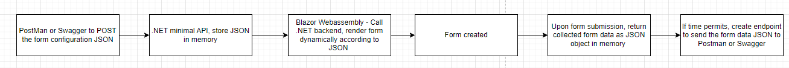
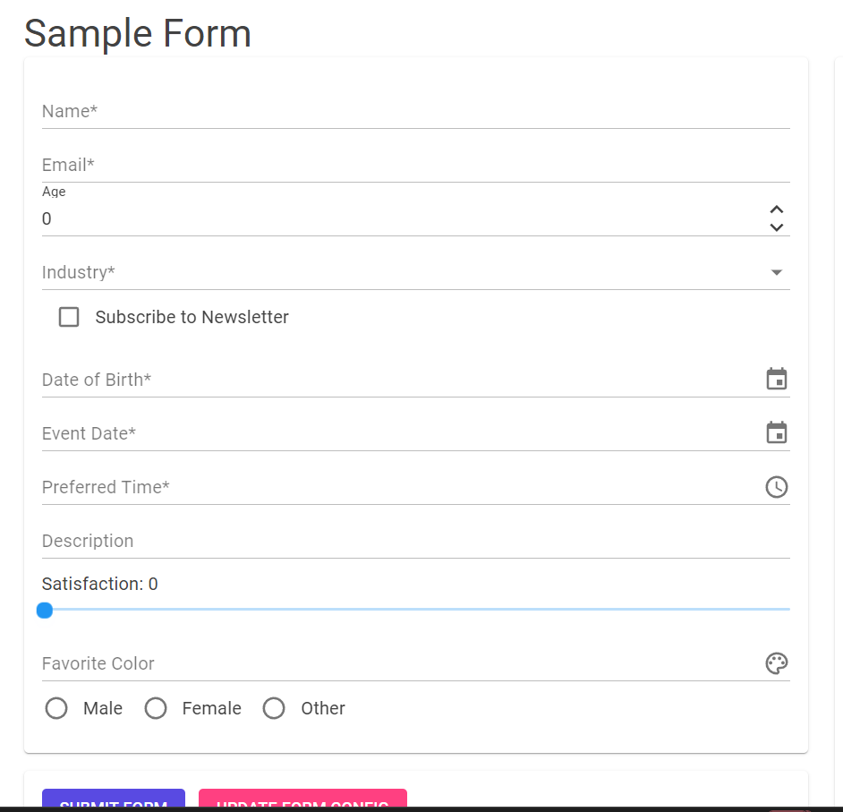
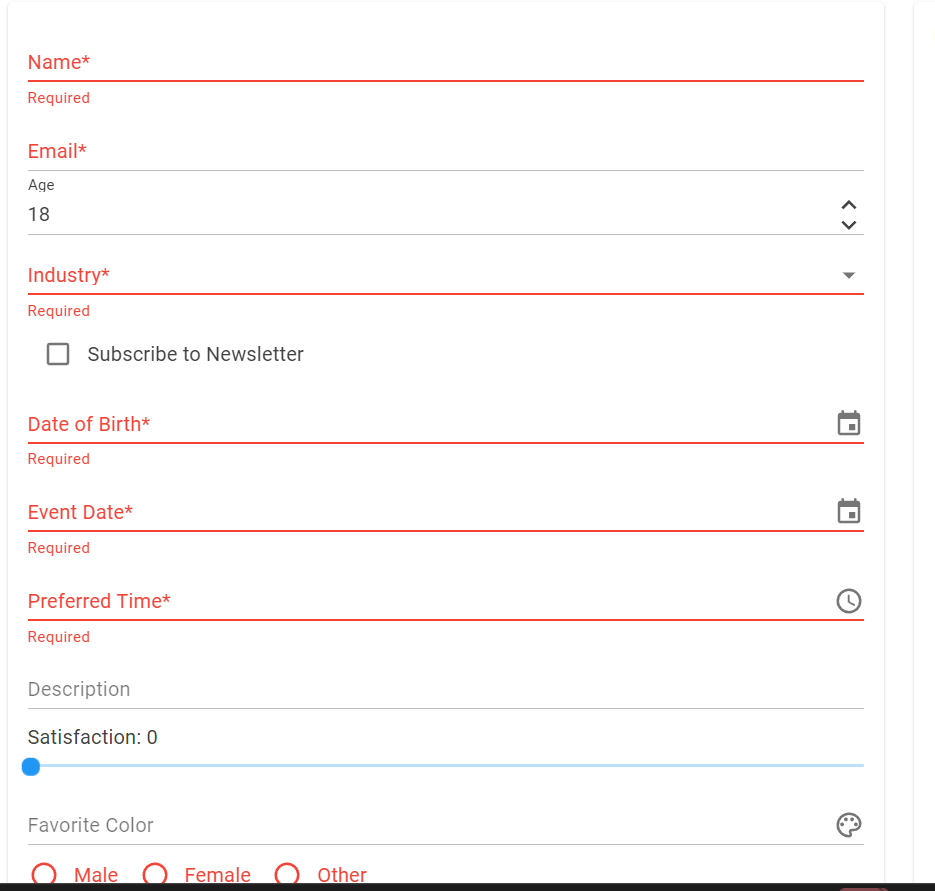
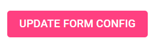
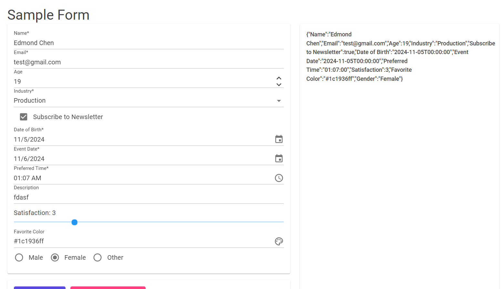

# IC-Eval-FE

# Development Tasks (Cross reference with appropriate branch):

## Frontend (FE)

- **FE-1**: Clear default pages in Blazor to prep for form development.
- **FE-2**: Install MudBlazor packages and other required packages.
- **FE-3**: Import default MudBlazor form as a template.
- **FE-4**: Create models based on json structure.
- **FE-5**: Try API call from backend.
- **FE-6**: Figure out how to dynamically create form fields as components.
- **FE-7**: Figure out how to convert user inputs into json response.
- **FE-8**: Refactor code behind and abstract away functions if neccesary.
- **FE-9**: Abstract away fragment creation into separate functions.
- **FE-10**: Email formatting.
- **FE-11**: Code cleanup.
- **BF-1**: Prevent dropdown/radio buttons from forming if values don't exist.


## Assumptions:
- The JSON file is always a valid form configuration.
- No file uploads are allowed since it's difficult to represent in a user response JSON.

# Architecture/Design
- Focused on serving a static JSON file from the Minimal API
- Didn't create endpoint to send JSON file to.



## Steps to Run the Application:

1. **Run the Backend:**
   - Follow the steps in the [IC-Eval-Backend GitHub repository](https://github.com/echen12/IC-Eval-Backend) to run the backend first.

2. **Clone the Application:**
   - Clone the Blazor WebAssembly (WASM) application to your local machine.

3. **Build the Application:**
   - Navigate to the application directory.
   - Open the .sln file in Visual Studio.
   - Run the following command in Developer Powershell to build the application:
     ```bash
     dotnet build
     ```

4. **Run the Application:**
   - Start the application with live reload in Developer Powershell using `dotnet watch`:
     ```bash
     dotnet watch
     ```

5. **If successful, you should see the form.**



## How it works:
- Some form fields are required so you must fill those in before submitting.



- To update how the form is configured, press this button here (your backend must be running and you must have a new valid form configuration json file):


- If the fields have been entered correctly, once you submit the form, the JSON response will appear as a string on the right side of the screen.

---
